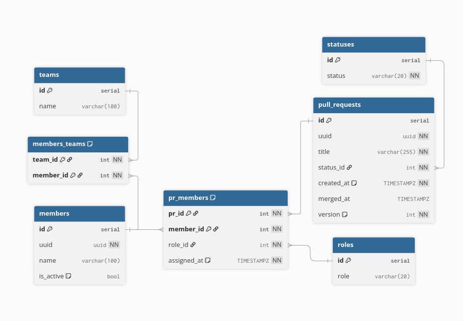

# PR Reviewer Service

Сервис для автоматического назначения ревьюверов на Pull Request'ы.

## Запуск проекта

1. Скопируйте `example.env` в `.env`:
```bash
cp example.env .env
```

2. Запустите сервис:
```bash
docker compose up
```

Сервис будет доступен на `http://localhost:8080`. Миграции применяются автоматически при старте.

## Реализация

### Архитектура

Проект следует принципам DDD (Domain-Driven Design) с разделением на слои:
- **Domain** — доменная модель и бизнес-правила
- **Repository** — работа с БД (PostgreSQL)
- **Service** — бизнес-логика
- **Transport** — HTTP handlers (Echo framework)

### Основной функционал

- **Команды**: создание команд с участниками, получение команды по имени
- **Пользователи**: управление активностью пользователей, получение списка PR для ревью
- **Pull Requests**: 
  - Автоматическое назначение до 2 активных ревьюверов из команды автора
  - Мерж PR (идемпотентная операция)
  - Переназначение ревьюверов (только для OPEN PR)

### База данных

Схема спроектирована с учётом гибкости и расширяемости:

- **Нормализованная структура**: отдельные таблицы для статусов (`statuses`) и ролей (`roles`) позволяют легко добавлять новые значения без изменения схемы
- **Junction-таблицы**: `members_teams` и `pr_members` реализуют many-to-many связи, поддерживая:
  - Принадлежность пользователя к нескольким командам
  - Разные роли участников PR (reviewer, approver и т.д.)
- **Версионирование**: поле `version` в `pull_requests` для optimistic locking
- **Гибкие роли**: таблица `roles` позволяет расширять систему ролей без миграций

Такая структура упрощает добавление новых функций (например, статистика, дополнительные роли, история изменений).

## Дополнительные задания

- ✅ **E2E тесты**: реализованы в `tests/e2e/` с использованием testcontainers-go для изоляции тестов
- ✅ **Линтер**: настроен `golangci-lint` с базовым набором правил (`.golangci.yml`)

## Команды разработки

```bash
make test              # unit тесты
make test-e2e         # e2e тесты
make test-coverage    # покрытие кода
make lint             # проверка линтером
make gen-mocks        # генерация моков
```

## API Endpoints

- `GET /health` — health check
- `POST /teams/add` — создать команду
- `GET /teams/get/:team_name` — получить команду
- `POST /users/setIsActive` — установить активность пользователя
- `GET /users/getReview/:id` — получить ревью пользователя
- `POST /pullRequest/create` — создать PR
- `POST /pullRequest/merge` — смержить PR
- `POST /pullRequest/reassign` — переназначить ревьювера


# ER БД
